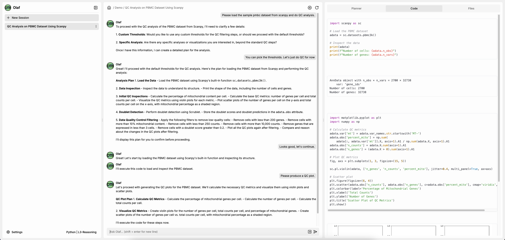

# OLAF (Open Life Science Analysis Framework)

Welcome to **OLAF (Open Life Science Analysis Framework)**!



OLAF is designed to streamline bioinformatics and computational biology workflows with an easy-to-use frontend and backend setup. This repository includes helper scripts to **quickly configure, start, and stop** OLAF with minimal effort.

---

## **Pre-requisites**

Before setting up OLAF, ensure you have the required **API keys** and **software dependencies** installed.

### **API Keys**

OLAF integrates with multiple APIs, so you’ll need to obtain keys for the following services:

- **OpenAI API Key** – Required for AI-driven functionalities. Get yours from [OpenAI](https://openai.com).
- **E2B API Key** – Needed for running isolated cloud environments. Sign up at [E2B](https://e2b.dev).
- **Google Cloud / Firebase** (Optional) – If you want to use Firebase for hosting or backend functions, you’ll need a **Firebase project** with an API key.

During setup, the script will prompt you to enter these API keys. If you don’t have them yet, visit the respective provider’s website to generate one.

---

### **Software Dependencies**

To run OLAF, install the following software:

- **Docker** – Required for running isolated backend services. Install it from [Docker’s website](https://www.docker.com/get-started).
- **Node.js & npm** – Needed for frontend and backend dependencies. Install from [Node.js](https://nodejs.org).
- **Firebase CLI** (if using Firebase) – Install it using:
  ```bash
  npm install -g firebase-tools
  ```
- **Git** – Required for cloning the repository and managing updates.

Ensure all dependencies are installed before running the setup scripts.

---

## **Getting Started**

To set up and run OLAF, follow the steps below.

### **1. Setup Backend**

This script will guide you through configuring the backend environment variables (API keys, templates, etc.).

```bash
./setup_backend.sh
```

What it does:

* Prompts you for required API keys and configuration values.
* Creates a .env file in the backend/functions/ directory.

### **1.5. Setup Frontend For Google Cloud (Optional)**

This step is only required if you want to use a Google Cloud / Firebase-based setup.

⚠️ Warning: This is intended for experienced Firebase/Google Cloud users. If you’re not using Firebase or Google Cloud, you can skip this step and run use the local setup.

```bash
./setup_frontend_google_cloud.sh
```

What it does:

* Prompts you for Firebase and API configurations.
* Generates an environment.ts file in the frontend/src/environments/ directory.
* Ensures your frontend is properly linked to Google Cloud.

### **2. Running OLAF**

Once everything is set up, you can start the system.

Run in Development Mode

```bash
./run_all.sh
```

What it does:

* Starts the frontend in development mode.
* Starts the backend (Firebase) services.
* Runs both in parallel.

### **3. Stopping OLAF**

To stop the backend (and optionally the frontend), run:

```bash
./stop_all.sh
```

What it does:

* Stops Firebase backend services.
* Optionally, you can modify this script to kill the frontend process.

## Contributing

We ❤️ open-source contributions! If you'd like to contribute:

1. Fork the repository
2. Create a feature branch (`git checkout -b feature-name`)
3. Commit your changes (`git commit -m "Add feature"`)
4. Push to your fork (`git push origin feature-name`)
5. Open a pull request 🚀

For major changes, please open an issue first to discuss your proposal.
